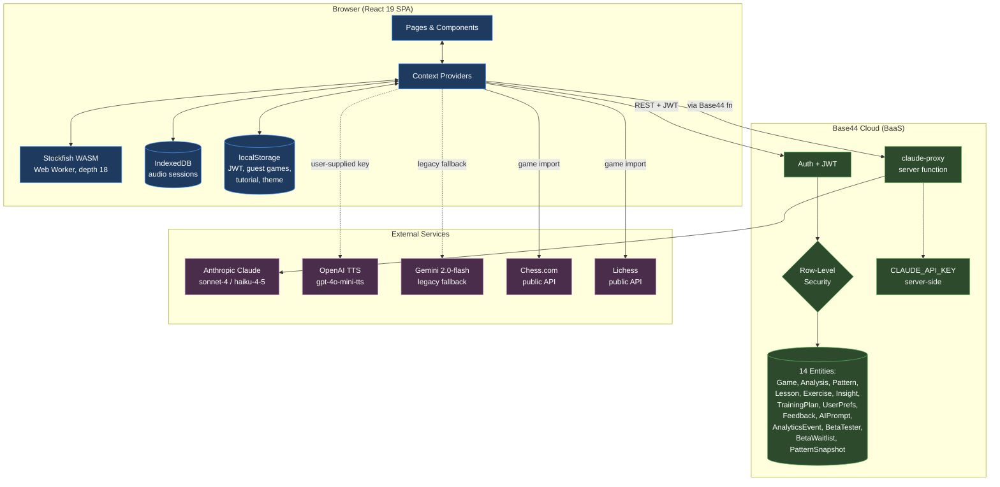
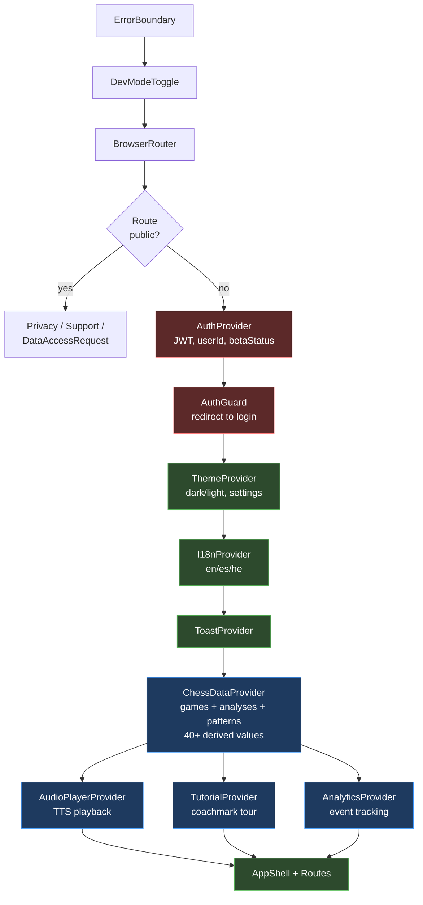
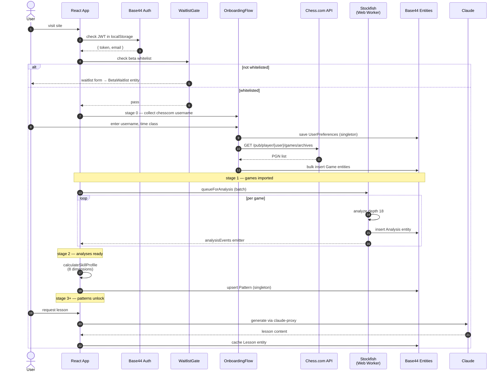
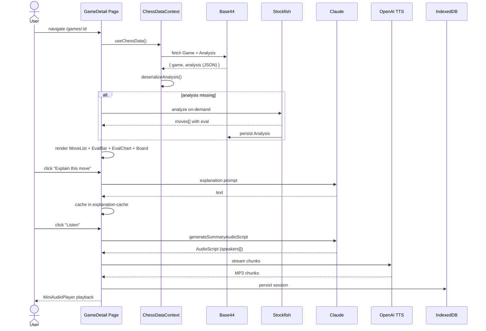
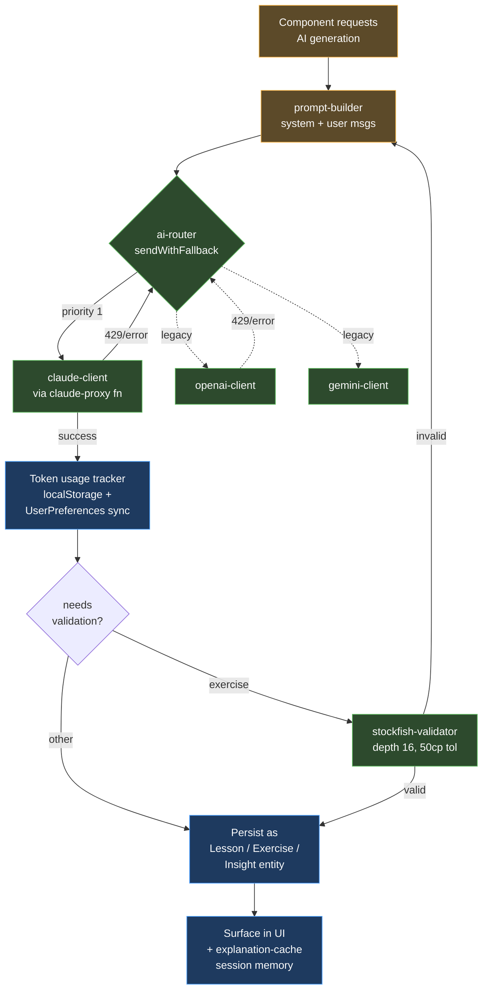
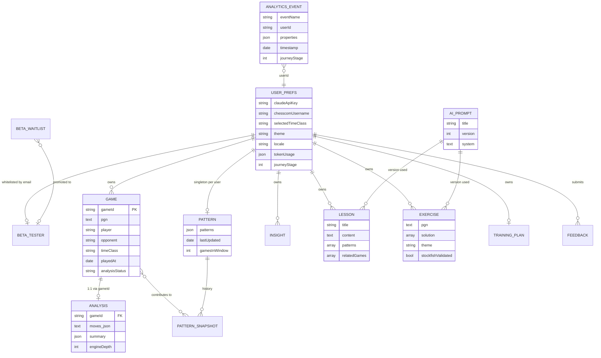
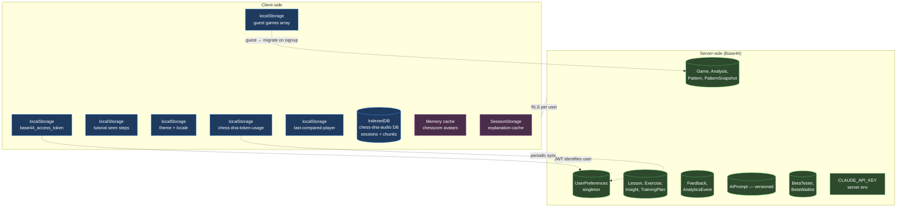
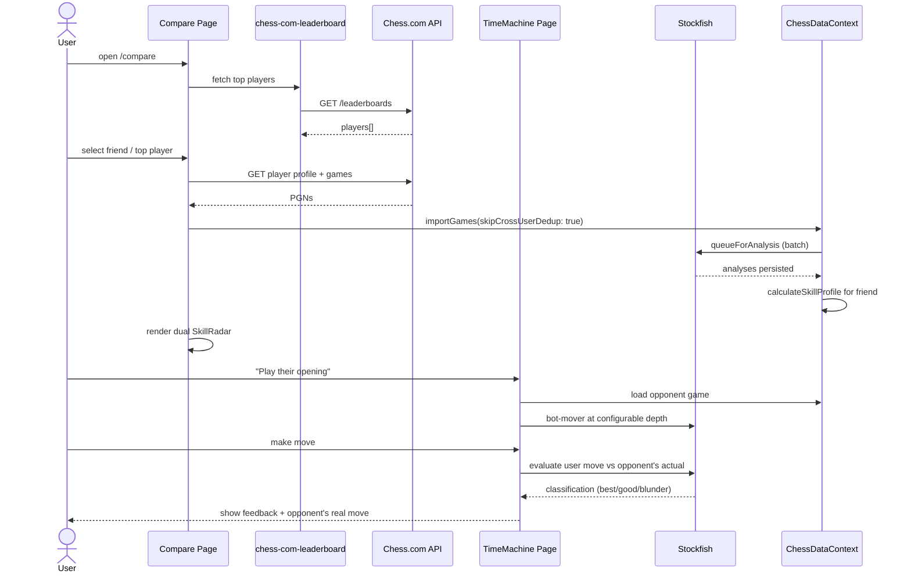
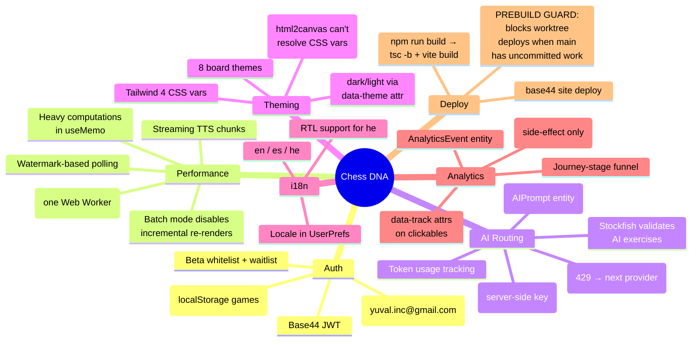

# Chess DNA — Architecture Diagrams

Current state of the app as of 2026-05-22. Mermaid diagrams covering system layers, UX flows, backend, and data flows.

---

## 1. System Overview

High-level view: browser app, Base44 backend, third-party services.



---

## 2. Context Provider Hierarchy

Defined in [src/App.tsx](src/App.tsx). Order matters — child providers depend on parents.



---

## 3. Routes & Navigation Map

19 routes, segmented by auth requirement and audience.

```mermaid
graph LR
    subgraph Public["Public (no auth)"]
        P1[/privacy/]
        P2[/support/]
        P3[/data-access-request/]
    end

    subgraph User["Authenticated User"]
        U1[/ Overview<br/>profile, radar, recent]
        U2[/games RecentGames]
        U3[/games/:id GameDetail<br/>move analysis]
        U4[/patterns Patterns<br/>weakness themes]
        U5[/lessons Lessons]
        U6[/exercises Exercises]
        U7[/training GettingBetter]
        U8[/timemachine TimeMachine<br/>opponent puzzles]
        U9[/compare Compare<br/>friend skill radar]
        U10[/settings Settings]
    end

    subgraph Admin["Admin only (yuval.inc@gmail.com)"]
        A1[/skill SkillStudio]
        A2[/affiliate AffiliateAdmin]
        A3[/prompts PromptsAdmin]
        A4[/feedbacks FeedbackAdmin]
        A5[/analytics AnalyticsAdmin]
    end

    subgraph Dev["Dev tools"]
        D1[/nav NavFlow sitemap]
        D2[/graph Graph viz]
    end

    U1 -.->|gate by<br/>journey stage| U4
    U1 -.->|gate by<br/>journey stage| U5
    U3 -->|share card| Share[html2canvas<br/>SHARE_COLORS]
    U8 -->|select opponent| U9

    classDef pub fill:#3a3a3a,stroke:#aaa,color:#fff
    classDef usr fill:#1e3a5f,stroke:#4a9eff,color:#fff
    classDef adm fill:#5c2929,stroke:#ff6b6b,color:#fff
    classDef dev fill:#4a4a2d,stroke:#cccc5c,color:#fff
    class P1,P2,P3 pub
    class U1,U2,U3,U4,U5,U6,U7,U8,U9,U10 usr
    class A1,A2,A3,A4,A5 adm
    class D1,D2 dev
```

---

## 4. UX Flow: New User Onboarding → First Insights

Journey stage 0 → 5. Gates locked features at each stage.



---

## 5. UX Flow: Game Detail Analysis

User opens a single game to study moves.



---

## 6. Data Flow: Game Import → Analysis → Patterns → Skill Profile

Core pipeline that powers the entire skill model.

```mermaid
flowchart LR
    subgraph Import["1. IMPORT"]
        CC[Chess.com API]
        LI[Lichess API]
        Manual[Paste PGN]
    end

    subgraph Parse["2. PARSE"]
        PGN[parsePgnToGameRecord<br/>chess.js]
    end

    subgraph Store1["3. PERSIST"]
        GE[(Game entity<br/>Base44)]
    end

    subgraph Analyze["4. ANALYZE"]
        Q[queueForAnalysis<br/>batch mode]
        SC[StockfishClient<br/>singleton worker<br/>depth 18]
        GA[game-analyzer<br/>classify moves]
        EC[eval-classifier<br/>win-chance loss]
        PD[phase-detector<br/>opening/mid/end]
        TD[tactical-detector<br/>fork/pin/skewer]
    end

    subgraph Store2["5. PERSIST"]
        AE[(Analysis entity<br/>JSON stringified)]
    end

    subgraph Compute["6. COMPUTE"]
        Snap[createSnapshot]
        PE[pattern-engine<br/>19 themes]
        WP[windowed-profile<br/>last 50 games]
        SK[skill-calculator<br/>8 dimensions]
        Bench[score-benchmarks<br/>percentile]
    end

    subgraph Store3["7. PERSIST"]
        PA[(Pattern entity<br/>singleton)]
        PS[(PatternSnapshot<br/>history)]
    end

    subgraph Surface["8. SURFACE"]
        Radar[SkillRadar UI]
        Tier[getTierForScore<br/>Pawn→King]
        Lessons[Lesson generator]
    end

    CC --> PGN
    LI --> PGN
    Manual --> PGN
    PGN --> GE
    GE --> Q
    Q --> SC
    SC --> GA
    GA --> EC
    GA --> PD
    GA --> TD
    EC --> AE
    PD --> AE
    TD --> AE
    AE --> Snap
    Snap --> PE
    Snap --> WP
    PE --> SK
    WP --> SK
    SK --> Bench
    SK --> PA
    PA --> PS
    PA --> Radar
    PA --> Tier
    PE --> Lessons

    classDef src fill:#4a2d4a,stroke:#c78fc7,color:#fff
    classDef proc fill:#2d4a2d,stroke:#5cb85c,color:#fff
    classDef store fill:#1e3a5f,stroke:#4a9eff,color:#fff
    classDef ui fill:#5c4a29,stroke:#ffb84a,color:#fff
    class CC,LI,Manual src
    class PGN,Q,SC,GA,EC,PD,TD,Snap,PE,WP,SK,Bench proc
    class GE,AE,PA,PS store
    class Radar,Tier,Lessons ui
```



---

## 7. Data Flow: AI Generation (Router + Fallback)

How any AI request (lessons, exercises, insights, explanations) is routed.



**Notes:**
- `claude-proxy` is a server-side Base44 function — `CLAUDE_API_KEY` never reaches the browser
- `openai-client` / `gemini-client` use user-supplied keys from `UserPreferences`; mostly legacy now
- Stockfish validates AI-generated exercises before they're persisted
- Token cost is tracked client-side and synced to `UserPreferences.tokenUsage`

---

## 8. Backend: Base44 Entities & RLS

14 entities, server-side row-level security. No `User` entity — identity comes from JWT.



---

## 9. Storage Architecture

Where data lives and what survives a reload / sign-out.



**Survival rules:**
| Storage | Survives reload | Survives sign-out | Synced to server |
|---|---|---|---|
| localStorage (JWT) | yes | no (cleared on logout) | n/a |
| localStorage (guest games) | yes | yes | only via migrate-on-signup |
| localStorage (token usage) | yes | yes | periodic sync to UserPrefs |
| IndexedDB (audio) | yes | cleared on sign-out | no |
| Memory cache (avatars, explanations) | no | no | no |
| Base44 entities | yes | yes | source of truth |

---

## 10. UX Flow: Friend Compare / Time Machine

How comparison and the time-machine puzzle mode work together.



---

## 11. Key Cross-Cutting Concerns



---

## 12. Critical Files Index

Files that punch above their weight — break these and a lot breaks.

| File | Why it's critical |
|---|---|
| [src/contexts/ChessDataContext.tsx](src/contexts/ChessDataContext.tsx) | Core data hub, 40+ derived values, all-hooks-before-returns |
| [src/pages/GameDetail.tsx](src/pages/GameDetail.tsx) | Complex hook ordering (React error #300/#310 risk) |
| [src/engine/stockfish-client.ts](src/engine/stockfish-client.ts) | Singleton WASM worker — breaks all analysis if broken |
| [src/patterns/skill-calculator.ts](src/patterns/skill-calculator.ts) | 8-dimension profile + fallback for broken joins |
| [src/shared/constants.ts](src/shared/constants.ts) | Thresholds cascade across the entire app |
| [src/hooks/useEntity.ts](src/hooks/useEntity.ts) | Base44 entity hooks with guest/auth branching |
| [src/ai/ai-router.ts](src/ai/ai-router.ts) | AI fallback orchestration |
| [src/ai/prompt-builder.ts](src/ai/prompt-builder.ts) | 32KB templated system prompts |
| [src/App.tsx](src/App.tsx) | Context nesting + route table |

---

*Generated 2026-05-22. Update when major flows change (new entities, new providers, new external services).*
